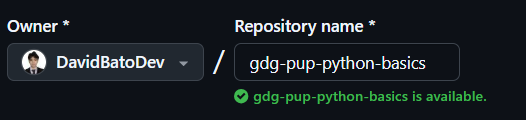

# 🧑🏻‍💻 Python Study Jam 🚀

Welcome to the **Python Workshop** hosted by GDG-PUP Web Development!

Get ready to dive deep into Python fundamentals and hands-on projects. Whether you're new to programming or sharpening your skills, this study jam will help you get comfortable with Python and equip you with the tools to build interactive applications.

### 👀 What's Inside It

This repository contains the following **main** folders:

1. **Assignments folder**: A collection of exercises designed to solidify your understanding of Python concepts.

## 📅 Assignments

###  Python Assignments

| No. | Topic                                     | Description                                                                                                                                      |
| --- | ----------------------------------------- | ------------------------------------------------------------------------------------------------------------------------------------------------ |
| 1   | Introduction to Python Syntax             | Explore Python's syntax, including variables, data types, and basic operators. Practice writing simple Python programs.                          |
| 2   | Control Flow – If, Elif, Else & Try Catch | Learn about conditional statements (`if`, `elif`, `else`) and exception handling using `try` and `except` blocks. Build an age-checking program. |
| 3   | Loops – For and While                     | Create a program that uses a `for` loop to iterate through a list and a `while` loop to print out a countdown.                                   |
| 4   | Functions                                 | Define functions in Python. Create functions that accept parameters and return values.                                                           |
| 5   | Lists and List Operations                 | Work with lists: create a list, access elements, and perform operations like adding, removing, and sorting.                                      |
| 6   | Dictionaries                              | Create dictionaries to store key-value pairs. Practice adding, removing, and updating dictionary items.                                          |
| 7   | File Handling                             | Learn how to read from and write to files. Create a program that reads from a file and outputs its contents.                                     |
| 8   | Object-Oriented Programming (OOP) Basics  | Dive into the basics of OOP: classes, objects, and methods. Build a simple class with attributes and methods to model a real-world object.       |

## 🌟 Getting Started with GDG-PUP Repository Template

Follow these steps to set up your own repository using the GDG-PUP template, complete with an existing directory structure and files to participate in the Python workshop.

1. Access the Template:

- Go to the main page of the GDG-PUP repository on GitHub.
- Click on the **Use this template** button.

2. Name and Visibility:

- Name the new repository following the format `gdg-pup-python-basics`
- Ensure it is set to public.

3. Create the Repository:

- Click Create repository on the lower right to generate it in your GitHub account.

3. Clone the Repository:

- Go to the repository’s main page, click on the Code button, and choose Open with GitHub Desktop to launch it in GitHub Desktop.

4. Complete the Clone:

In GitHub Desktop, click Clone to download the repository to your local machine.

---

## Submission

- For submission, an assignment in Google Classroom will be provided where you can upload the necessary requirements for this workshop. Please check Google Classroom for further details and deadlines for each assignment.

## 🎉 Happy Coding!

We’re excited to see your creativity and dedication shine through this project. Let’s make this an amazing learning experience together. Remember, every line of code you write brings you one step closer to mastering Python. Good luck, and enjoy the journey! 🚀💻
